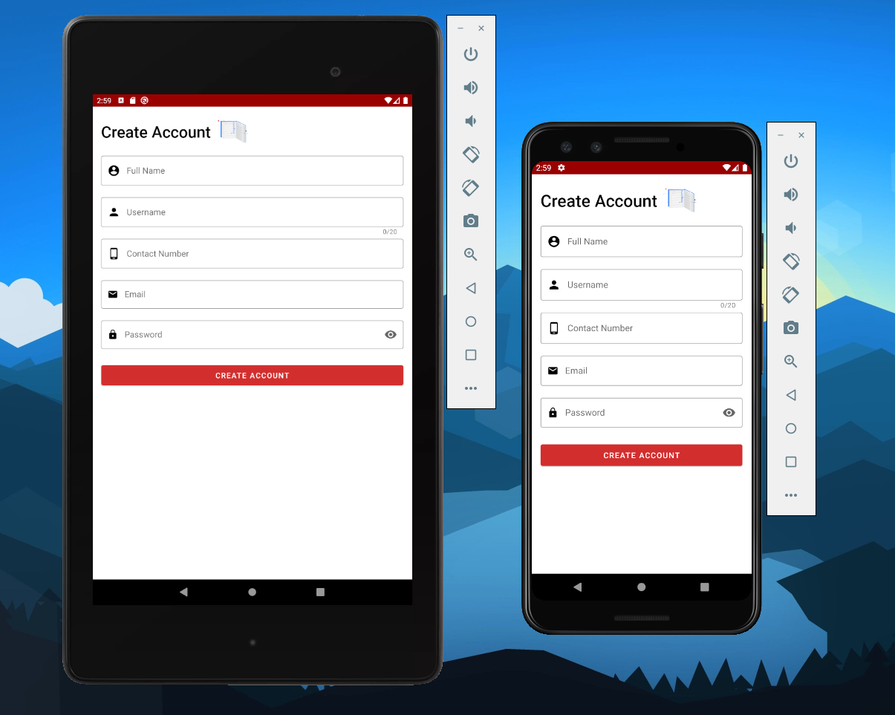
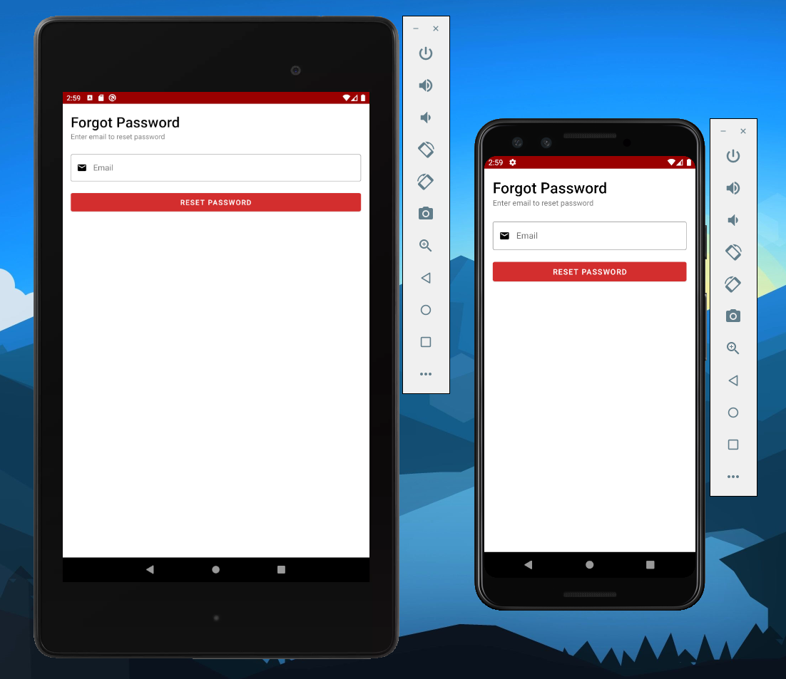
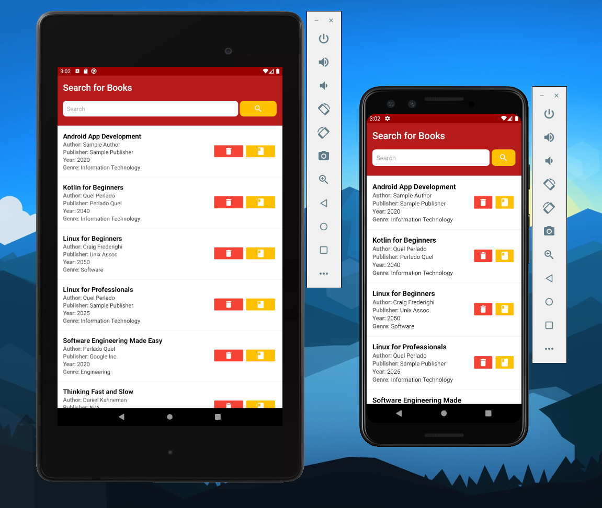
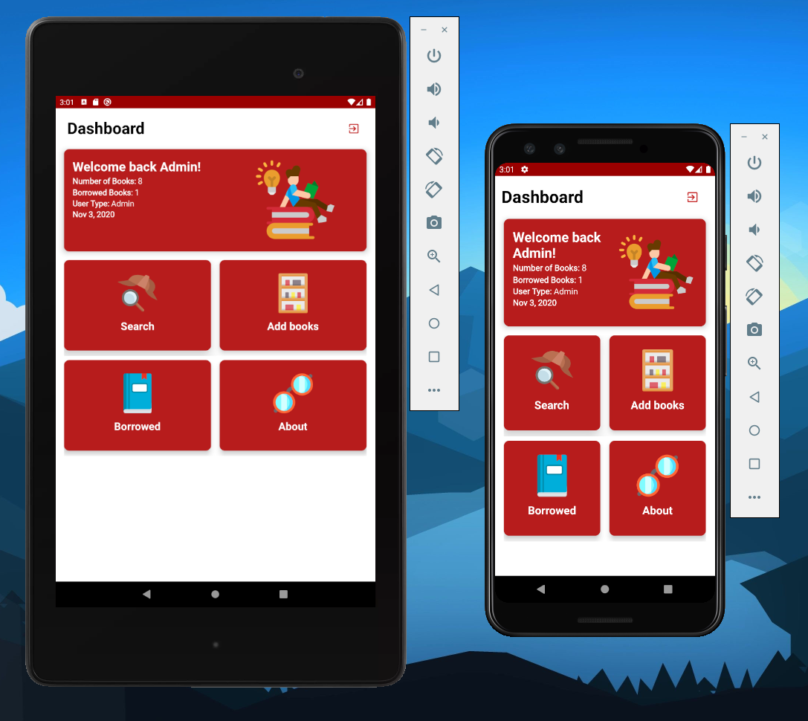
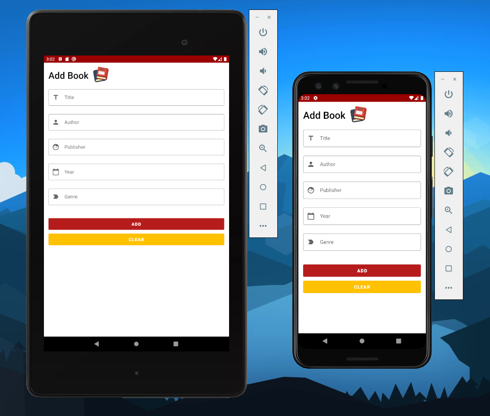
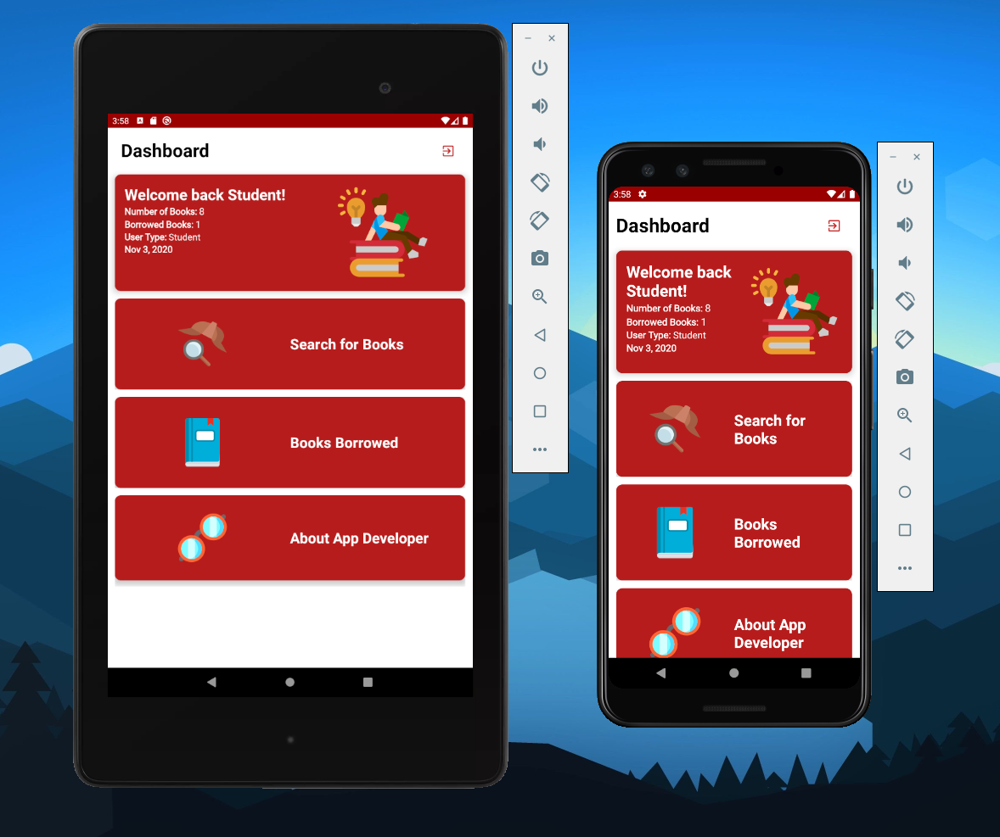

# Library Manager :closed_book:
Library Manager is a Library Management App that has all the basic functionality of a Library. Organizations like schools can benefit from its functions like: Borrowing, Searching, Removing, Approving and Returning Books.

# Technology Used :iphone:
**Firebase :fire:**
- Realtime Database (Non relational Database)
- Authentication

**Android**
- Android Studio ver 4.1
- Android Oreo (API 26)
- Material IO Material Components for android

**Flaticon**
- Icons made by <a href="https://www.flaticon.com/authors/freepik" title="Freepik">Freepik</a> from <a href="https://www.flaticon.com/" title="Flaticon"> www.flaticon.com</a>

# App Components

## Create Account
- #### After registering for an account a confirmation email will be sent and it needs to be confirmed before logging in. If not confirmed user cannot log in and will be prompted to confirm the account first.
- #### Accounts created will automatically be considered as students with non-administrative privileges.

## Forgot Password
- #### If ever a user forgets the password of his/her account they can request for a password reset by provinding the email of the registered account, after that an email will be sent to them for password reset.

## Login
- #### There are two account types, account with admin and non-admin privileges.
- #### Admins has the ability to Search, Remove, Approve, Add, and Return books.
- #### Non-Admins has the ability to Search, Borrow, See their Borrowed Books, See pending borrow Request.

## Administrative privileges
### Search
- #### Search by the Title of the book you are looking for.
- #### In the search section an admin can borrow a book and also delete a book directly from the search section.

### Add Books
- #### Only accounts with administrative privileges can add new books to the app.

### Borrowing and Approving Pending Request
- #### After a non-administrative account borrows a book it goes to the pending request of the admin, only the admin can approve the users borrow request or decline it.
- #### In this sample the tablet(Nexus 7) has an administrative account logged in and in the smartphone(pixel 3) has an non-administrative account currently logged in.

## Non-Admin privileges
### Search
- #### Search by the Title of the book you are looking for.
- #### In the search section non-admins can only borrow books on the library manager.
- #### In this sample both of the tablet and phone has non-admin accounts logged into it.

### See borrowed books
- #### After a non-admin borrow books the user can see the books they have borrowed after approval of the admin.
- #### The non-admin user can only see the books he/she have borrowed from the library.
- #### Only accounts with administrative privileges can return the books borrowed by the user. (Context: User brings back the book to the Librarian, Librarian checks the borrowed books and returns it. It confirms that the books is returned physically and also provides authenticity if the books being returned are the same)

### See Pending Borrow request
- #### After a non-admin user borrows a book it will automatically be added to the pending request section of both user but as said earlier the admin only has the right to approve or decline the request.
- #### Both devices on this sample has a non-administrative privilege. 

## About

## Additional Screenshots from the app

### Admin Components
#### Dashboard (Admin)

#### Search (Admin)

#### Add Books (Admin)

#### Borrowed Books (Admin)

#### Pending Borrow Request (Admin)

### Non Admin Components
#### Dashboard (Non-admin)

#### Search (Non-admin)

#### Borrowed Books (Non-admin)

#### Pending Borrow Request (Non-admin)

